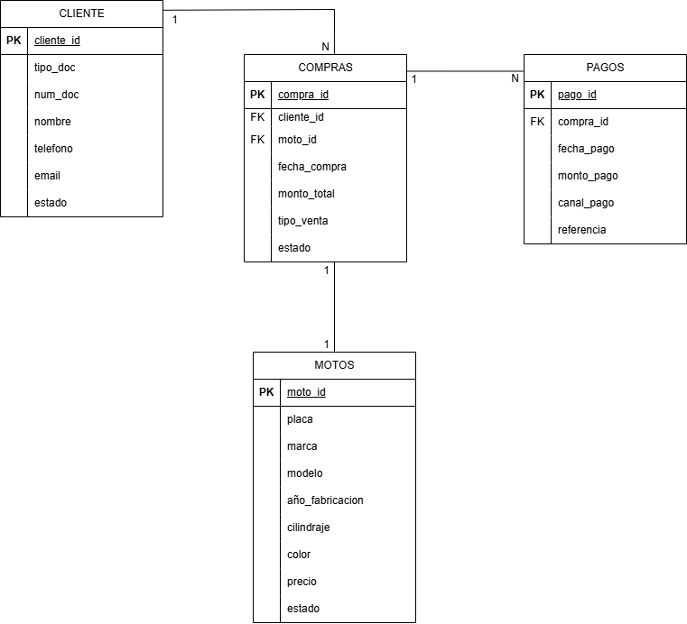
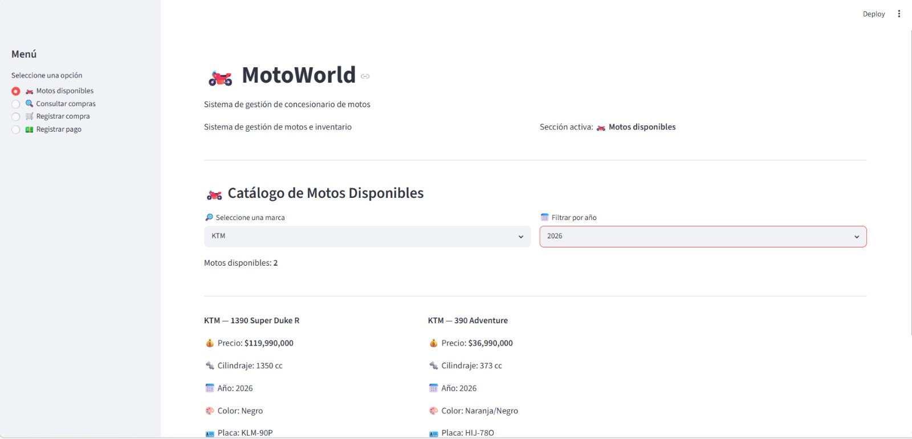
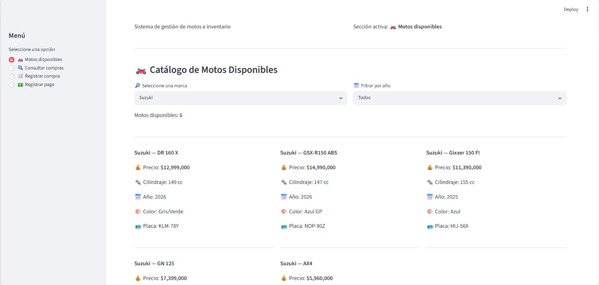
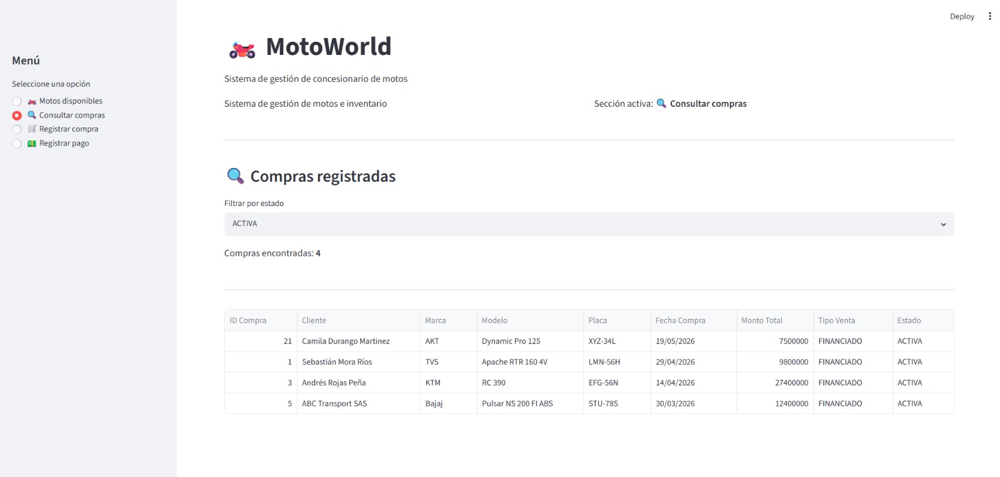
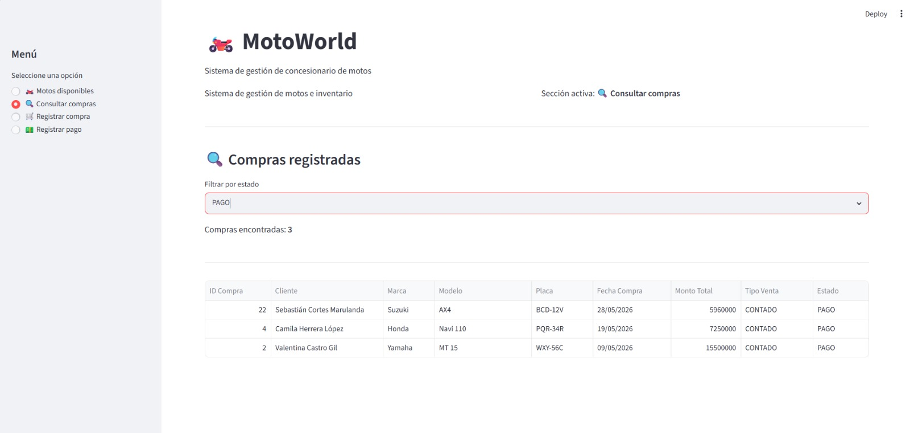
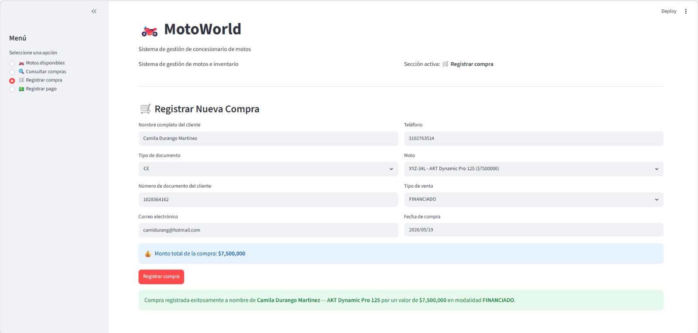
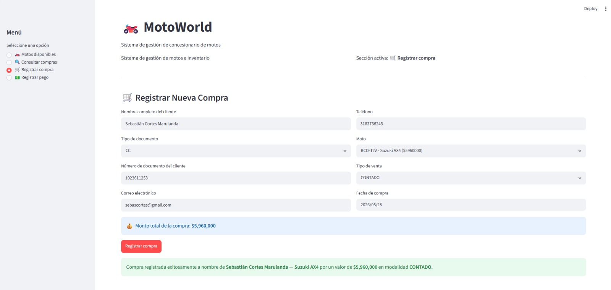
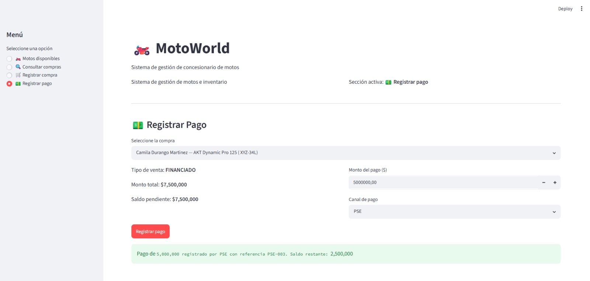
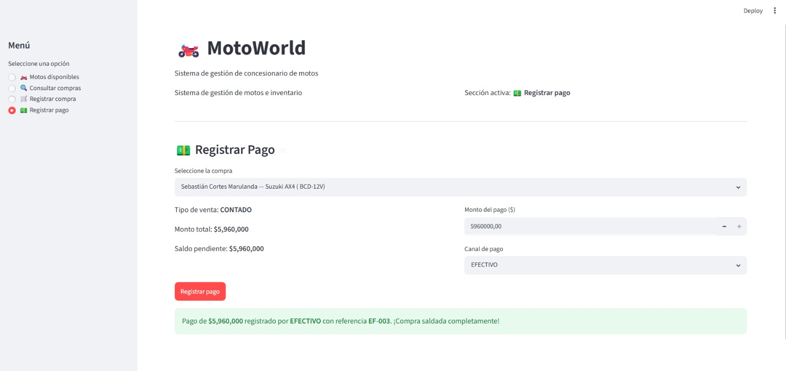

# _MotoWorld — Sistema de Gestión de Concesionario de Motos_

_MotoWorld es una aplicación web desarrollada como proyecto final de la asignatura Introducción al BI.
El proyecto fue diseñado utilizando Oracle SQL Developer para la construcción, administración y como motor de almacenamiento
de las bases de datos, Python para la lógica de negocio y Streamlit para la interfaz visual._

_La aplicación simula el funcionamiento básico de un concesionario de motos, permitiendo gestionar el inventario de motos disponibles,
registrar las compras realizadas por los clientes y controlar los pagos asociados a cada venta.
El objetivo principal es centralizar la información del negocio y facilitar el seguimiento de las operaciones realizadas dentro del concesionario._

## _Integrantes del grupo_

- _Cristian Jair Betancur Valencia_
- _Juan David Quintero Londoño_

## _Dominio elegido y justificación_

_Para este proyecto se eligió el dominio de un concesionario de motos debido a que combina diferentes
procesos que pueden ser modelados mediante una base de datos relacional. Dentro de este tipo de negocio es necesario administrar inventario,
registrar clientes, controlar ventas y realizar seguimiento a los pagos efectuados por los compradores._

_Además, Cada moto se identifica mediante una placa única, lo que permite establecer reglas de negocio claras 
y relaciones bien definidas entre las entidades del sistema. Esto convierte al concesionario en un 
escenario pertinente para aplicar conceptos de modelo relacional, integración de datos y desarrollo de aplicaciones conectadas a una base de datos._


## _Diagrama Entidad-Relación (ERD)_




_**Relaciones del modelo:**_

- _Un cliente puede realizar múltiples compras **(1:N)**_
- _Una compra puede tener muchos pagos **(1:N)**_
- _Una moto solo puede asociarse a una compra **(1:1)**. Cuando un cliente compra una moto, esta deja de estar disponible para ser
adquirida nuevamente por otro cliente. Por esta razón, cada moto está en una única venta dentro del sistema.
Para garantizar el cumplimiento de esta regla de negocio, se definió la restricción UNIQUE(moto_id) en la tabla mt_compras, 
evitando que una misma moto sea registrada en múltiples compras._

## _Descripción de las tablas y sus restricciones_

### _mt_clientes_

_Almacena la información personal de los clientes que realizan compras en el concesionario. 
Puede tratarse tanto de personas naturales como de empresas._

| _**Columna**_    | _**Tipo**_        | _**Descripción**_                       |
|------------------|-------------------|-----------------------------------------|
| _**cliente_id**_ | _NUMBER IDENTITY_ | _Identificador único autoincremental_   |
| _**tipo_doc**_   | _VARCHAR2 (5)_    | _Tipo de documento: CC, CE, NIT o PP_   |
| _**num_doc**_    | _VARCHAR2 (20)_   | _Número de documento_                   |
| _**nombre**_     | _VARCHAR2 (30)_   | _Nombre completo o razón social_        |
| _**telefono**_   | _VARCHAR2 (15)_   | _Teléfono de contacto (opcional)_       |
| _**email**_      | _VARCHAR2 (50)_   | _Correo electrónico (opcional)_         |
| _**estado**_     | _VARCHAR2 (15)_   | _Estado del cliente: ACTIVO o INACTIVO_ |

**Restricciones implementadas:**

- _**PRIMARY KEY (cliente_id):** Identifica de manera única cada cliente_
- _**UNIQUE (tipo_doc, num_doc):** No puede existir el mismo número de documento para el mismo tipo, evitando duplicados_
- _**CHECK (estado IN ('ACTIVO','INACTIVO')):** Solo son válidos estos dos estados_
- _**CHECK (tipo_doc IN ('CC','CE','NIT','PP')):** Solo se aceptan estos tipos de documentos: 'CC','CE','NIT','PP'_


### _mt_motos_

_Contiene el inventario de motos administrado por el concesionario.
Cada registro representa una moto física específica, identificada mediante una placa única._

| _**Columna**_         | _**Tipo**_        | _**Descripción**_                      |
|-----------------------|-------------------|----------------------------------------|
| _**moto_id**_         | _NUMBER IDENTITY_ | _Identificador único autoincremental_  |
| _**placa**_           | _VARCHAR2 (10)_   | _Placa de la moto_                     |
| _**marca**_           | _VARCHAR2 (30)_   | _Marca de la moto_                     |
| _**modelo**_          | _VARCHAR2 (40)_   | _Modelo específico_                    |
| _**año_fabricacion**_ | _NUMBER (5)_      | _Año de fabricación_                   |
| _**cilindraje**_      | _NUMBER (5)_      | _Cilindraje en cc_                     |
| _**color**_           | _VARCHAR2 (20)_   | _Color de la moto_                     |
| _**precio**_          | _NUMBER (12,2)_   | _Precio de venta en pesos colombianos_ |
| _**estado**_          | _VARCHAR2 (15)_   | _Estado de disponibilidad de la moto_  |

_**Restricciones implementadas:**_

- _**PRIMARY KEY (moto_id):** Identificador único por moto_
- _**UNIQUE (placa):** Ninguna moto puede tener la misma placa_
- _**CHECK (estado IN ('DISPONIBLE','VENDIDA')):** Controla la disponibilidad de las motos en esos dos estados_
- _**CHECK (cilindraje > 0):** Válida que el cilindraje sea un valor positivo_
- _**CHECK (precio >= 0):** Evita precios negativos_
- _**CHECK (año_fabricacion >= 2000):** El concesionario solo trabaja con motos modernas_

### _mt_compras_

_Registra las ventas realizadas entre los clientes y las motos disponibles.
Esta tabla constituye el eje central del sistema, ya que conecta la información de clientes con 
las motos vendidas y permite posteriormente gestionar los pagos asociados a cada transacción._

| _**Columna**_      | _**Tipo**_        | _**Descripción**_                     |
|--------------------|-------------------|---------------------------------------|
| _**compra_id**_    | _NUMBER IDENTITY_ | _Identificador único autoincremental_ |
| _**cliente_id**_   | _NUMBER_          | _Cliente asociado_                    |
| _**moto_id**_      | _NUMBER_          | _Moto comprada_                       |
| _**fecha_compra**_ | _DATE_            | _Fecha en que se realizó la compra_   |
| _**monto_total**_  | _NUMBER (12,2)_   | _Valor total de la venta_             |
| _**tipo_venta**_   | _VARCHAR2 (15)_   | _Tipo de venta_                       |
| _**estado**_       | _VARCHAR2 (15)_   | _Estado de la compra_                 |


_**Restricciones implementadas:**_

- _**PRIMARY KEY (compra_id):** Identificador único por compra_
- _**FOREIGN KEY (cliente_id):** Garantiza que el cliente exista en el sistema_
- _**FOREIGN KEY (moto_id):** Garantiza que la moto exista en el sistema_
- _**UNIQUE (moto_id):** Evita que la misma moto se venda más de una vez_
- _**CHECK (monto_total >= 0):** Evita valores negativos_
- _**CHECK (tipo_venta IN ('CONTADO','FINANCIADO')):** Clasifica el tipo de venta_
- _**CHECK (estado IN ('ACTIVA','CANCELADA','PAGO')):** Controla el estado de la compra_

### _mt_pagos_

_Registra los pagos realizados por los clientes sobre las compras efectuadas. 
Permite llevar el control de los abonos y el estado financiero de cada venta._

| _**Columna**_    | _**Tipo**_        | _**Descripción**_                     |
|------------------|-------------------|---------------------------------------|
| _**pago_id**_    | _NUMBER IDENTITY_ | _Identificador único autoincremental_ |
| _**compra_id**_  | _NUMBER_          | _Compra asociada_                     |
| _**fecha_pago**_ | _DATE_            | _Fecha en que se realizó el pago_     |
| _**monto_pago**_ | _NUMBER (12,2)_   | _Valor del pago_                      |
| _**canal_pago**_ | _VARCHAR2 (20)_   | _Medio de pago utilizado_             |
| _**referencia**_ | _VARCHAR2 (30)_   | _Referencia única del pago_           |

_**Restricciones implementadas:**_

- _**PRIMARY KEY (pago_id):** Identificador único por pago_
- _**FOREIGN KEY (compra_id):** Garantiza que el pago esté asociado a una compra real_
- _**UNIQUE (referencia):** Evita referencias duplicadas_
- _**CHECK (monto_pago >= 0):** Válida montos positivos_
- _**CHECK (canal_pago IN ('EFECTIVO','TRANSFERENCIA','TC','PSE')):** Controla medios de pago válidos_


## _Reglas de negocio implementadas y su justificación_

_**1. Una moto solo puede venderse una vez**_

_En el concesionario, una vez que una moto es vendida deja de estar disponible para futuras transacciones. 
Esto evita que la misma moto pueda ser asociada a más de una compra y garantiza la consistencia del inventario. 
Esta regla se implementó mediante la restricción UNIQUE(moto_id) en la tabla mt_compras._

_**2. La moto desaparece del catálogo al venderse**_

_Cuando se registra una compra, el estado de la moto cambia automáticamente de DISPONIBLE a VENDIDA.
De esta forma, los usuarios solo pueden visualizar y seleccionar motos que realmente se encuentran disponibles para la venta, 
evitando errores y duplicidad en las transacciones._

_**3. Toda compra pasa por caja sin excepción**_

_Independientemente de si la venta es de contado o financiada, la compra queda registrada inicialmente 
como activa y los pagos realizados se almacenan en la tabla mt_pagos. Esto permite llevar un control detallado 
de los movimientos de dinero asociados a cada venta y consultar posteriormente el historial de pagos realizado por cada cliente._

_**4. El saldo pendiente se calcula dinámicamente**_

_El sistema no almacena directamente el saldo pendiente de una compra. En su lugar, este valor se calcula en el mismo momento que el cliente realiza un pago, 
tomando el monto total de la venta y restando la suma de los pagos efectuados. Con esto se evita la duplicidad de información 
y se garantiza que el saldo mostrado siempre corresponda a la realidad de la transacción._

_**monto_total - NVL(SUM(monto_pago), 0) AS saldo_pendiente**_

_**5. La compra se cierra automáticamente al saldarse**_

_Cuando la suma de los pagos registrados alcanza el valor total de la compra, el sistema actualiza automáticamente el estado de la venta a PAGO.
Esto permite identificar fácilmente cuáles compras continúan pendientes y cuáles ya fueron canceladas en su totalidad._

_**6. Cada pago debe contar con una referencia única**_

_Todo pago registrado genera una referencia única que permite identificarlo y diferenciarlo de cualquier otro movimiento realizado en el sistema.
Esta medida facilita la trazabilidad de las transacciones y evita registros duplicados o inconsistentes._

_**7. Solo se permiten tipos de documento válidos para el contexto del negocio**_

_Con el fin de mantener la calidad de la información almacenada, el sistema únicamente admite los tipos de documento definidos para el proyecto
(CC, CE, NIT y PP). Esto ayuda a garantizar que los registros de clientes sean coherentes y estén estandarizados._

## _Instrucciones para ejecutar la aplicación localmente_

### _Requisitos previos_
_Antes de ejecutar el proyecto es necesario contar con los siguientes componentes instalados y configurados:_
- _Intérprete de Python versión 3.10 o superior._
- _Oracle Instant Client instalado en el equipo._
- _Oracle SQL Developer o cualquier cliente compatible para ejecutar los scripts SQL._
- _Acceso a una base de datos Oracle con permisos para crear tablas e insertar registros._

### _Pasos_

_**1. Clonar el repositorio:**_

_Descargar o clonar el repositorio desde GitHub y ubicarse en la carpeta principal del proyecto._

_**2. Crear y activar el entorno virtual:**_

_Se recomienda trabajar dentro de un entorno virtual para aislar las dependencias del proyecto._

```bash
python -m venv .venv
.venv\Scripts\activate
```

_**3. Instalar dependencias:**_

_Instalar todas las librerías necesarias definidas en el archivo requirements.txt._

```bash
pip install -r requirements.txt
```

_**4. Configurar las credenciales:**_

_Crear un archivo llamado .env en la raíz del proyecto y registrar los parámetros de conexión a la base de datos Oracle._


```
DB_USER=tu_usuario
DB_PASSWORD=tu_contraseña
DB_DSN=nombre_del_servicio
ORACLE_CLIENT=ruta_del_instant_client
```

_**5. Ejecutar los scripts SQL en Oracle:**_

_Abrir Oracle SQL Developer y ejecutar los scripts SQL en el siguiente orden:_

1. _scripts/ddl.sql para crear las tablas y restricciones._
2. _scripts/dml.sql para insertar los datos iniciales de prueba._

_**6. Ejecutar la aplicación**_

_Desde la carpeta principal del proyecto, ejecutar el siguiente comando:_

```bash
python -m streamlit run app/app.py
```

_Una vez iniciado el servidor, la aplicación estará disponible desde el
navegador web en la dirección local que Streamlit muestre en la terminal._

## _Capturas de pantalla de la aplicación en funcionamiento_
_A continuación se presentan algunas evidencias del funcionamiento de la aplicación, mostrando 
las principales funcionalidades implementadas para la gestión del concesionario de motos._

### _Catálogo de motos disponibles con filtros por marca y año_
_Esta sección permite consultar las motos disponibles en el inventario y aplicar filtros
para facilitar la búsqueda según las necesidades del usuario._





### _Consulta de compras filtradas por estado_
_Permite visualizar las compras registradas y filtrarlas según su estado, facilitando el 
seguimiento de las ventas realizadas._





### _Formulario de registro de nueva compra_
_Desde esta interfaz se registran nuevas ventas, asociando un cliente con una moto disponible 
en el inventario._





### _Formulario de registro de pago con saldo pendiente_
_Permite registrar pagos asociados a una compra activa, visualizar el saldo pendiente
y actualizar automáticamente el estado de la venta cuando esta es cancelada en su totalidad._





## _Reflexión del equipo: dificultades encontradas y aprendizajes_

_El desarrollo de MotoWorld permitió aplicar de manera práctica los conocimientos adquiridos durante el curso 
sobre bases de datos relacionales, SQL y desarrollo de aplicaciones conectadas a una fuente de datos real._

### _Dificultades_

_Una de las primeras dificultades fue elegir el dominio de negocio a modelar. Existen muchas ideas posibles
y resulta complicado decidirse por una que sea lo suficientemente compleja para justificar múltiples tablas
relacionadas, pero que al mismo tiempo sea manejable dentro del alcance del proyecto.
Al final se optó por un concesionario de motos, ya que combina procesos claros de inventario,
ventas y pagos que se prestan bien para el sistema relacional._

_Otra dificultad fue definir correctamente las restricciones de integridad en cada tabla.
En varios momentos surgió la duda de si una restricción era realmente necesaria o si por el contrario
estaba siendo redundante. Entonces, este ejercicio ayudó a entender que cada restricción debe estar 
justificada por una regla real del negocio y no simplemente agregarse para cumplir un requisito._

_También representó un reto el manejo de credenciales mediante variables de entorno.
Era la primera vez que trabajábamos con un archivo .env y con la librería python-dotenv para separar
las credenciales del código fuente. Al principio no era claro cómo configurarlo ni cómo asegurarse
de que el archivo .env no fuera subido al repositorio de GitHub, pero una vez comprendido el flujo
con el archivo .gitignore, resultó ser una práctica muy útil y aplicable en cualquier proyecto real._

### _Aprendizajes_

_Uno de los aspectos más importantes fue comprender que una buena aplicación comienza con un modelo de datos bien diseñado. 
Antes de desarrollar la interfaz o escribir consultas complejas, fue necesario definir correctamente las entidades, 
las relaciones y las restricciones que representarían las reglas del negocio._

_Aunque lo mencionamos como una dificultad, cabe destacar que fortalecimos los conocimientos relacionados con la integridad de los datos.
Las claves primarias, claves foráneas y restricciones de validación demostraron ser herramientas fundamentales para garantizar 
que la información almacenada fuera consistente y confiable. Otro aprendizaje significativo fue la integración entre Oracle Database y Python mediante Streamlit.
Esto permitió observar cómo las operaciones realizadas por el usuario en la interfaz se reflejan directamente 
en la base de datos, simulando el comportamiento de un sistema utilizado en un entorno real._

_Finalmente, el proyecto ayudó a desarrollar habilidades complementarias como la organización de archivos, 
el uso de GitHub para documentar y gestionar el trabajo, y la importancia de mantener una estructura clara 
tanto en el código como en la documentación. En conjunto, la experiencia permitió comprender mejor el papel
que desempeñan las bases de datos en la gestión de información y en el apoyo a la toma de decisiones dentro de una organización._
